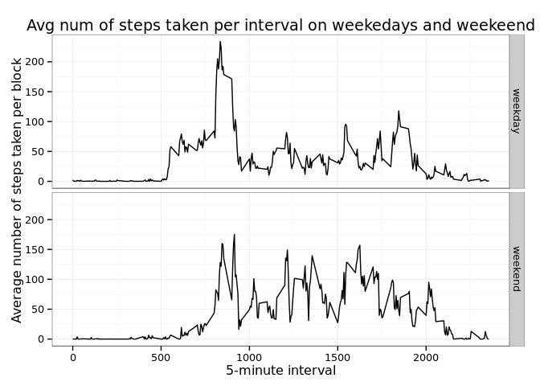

# Reproducible Research: Peer Assessment 1
Jordi Cuadrado Borbonés  
15 de noviembre de 2015  
This document contains the solution to the Coursera's Data Science Specialization course #5 [Reproducible Research](https://class.coursera.org/repdata-034). Both the source R Markdown (Rmd) file, the interpreted (md) file, and the output (processed) HTML file can be found in [this repository](https://github.com/jordicuadrado/RepData_PeerAssessment1).

  
## Set global options

First of all, proceed to set global options to show R code in the output. This step can be ignored because only echo=FALSE will hide the code and the default setting is to show the code.

```r
knitr::opts_chunk$set(echo = TRUE)
```


## Loading and preprocessing the data

First, if it's not already set, change to the current working directory. Extract the CSV file in "activity.zip". Then, read the CSV into a data frame and convert the date to an actual date format. Finally, show the first rows to have a glimpse of the data.

```r
setwd("~/Data Science Specialization/5 - Reproducible Research/Project 1/RepData_PeerAssessment1/")
unzip("activity.zip") #https://stat.ethz.ch/R-manual/R-devel/library/utils/html/unzip.html
dataActivity <- read.csv("activity.csv", header = T, sep = ',', na.strings = "NA", quote = '\"')
dataActivity$date <- as.Date(dataActivity$date, format = "%Y-%m-%d")
head(dataActivity)
```

```
##   steps       date interval
## 1    NA 2012-10-01        0
## 2    NA 2012-10-01        5
## 3    NA 2012-10-01       10
## 4    NA 2012-10-01       15
## 5    NA 2012-10-01       20
## 6    NA 2012-10-01       25
```


## What is mean total number of steps taken per day?

1. Calculate the total number of steps taken per day:

```r
stepsDay <- aggregate(dataActivity$steps, by=list(dataActivity$date), FUN=sum, na.rm=TRUE)
names(stepsDay) <- c("date", "steps")
```


2. Make a histogram of the total number of steps taken each day:

```r
library(ggplot2)
g <- ggplot(data=stepsDay, aes(stepsDay$steps)) + 
      geom_histogram(breaks=seq(0, 25000, by=1000), 
                     #col="black", 
                     aes(fill=..count..)) +
      #if we want to change the fill color to a "traffic light" one:
      #scale_fill_gradient("Count", low = "green", high = "red") + 
      labs(x = "Total number of steps") +
      labs(title="Total number of steps taken each day")
print(g) #dev.off
```

 


3. Calculate and report the mean and median of the total number of steps taken per day:

```r
meanSteps <- mean(stepsDay$steps)
medianSteps <- median(stepsDay$steps)
```

* Mean: 9354.2295082
* Median: 10395


## What is the average daily activity pattern?

1. Make a time series plot (i.e. type = "l") of the 5-minute interval (x-axis) and the average number of steps taken, averaged across all days (y-axis):

```r
meanSteps <- aggregate(dataActivity$steps, by=list(dataActivity$interval), FUN=mean, na.rm=TRUE)
names(meanSteps) <- c("interval", "meanSteps")

g <- ggplot(data=meanSteps, aes(x=interval, y=meanSteps)) +
      geom_line() +
      labs(x = "5-minute interval") +
      labs(y = "Average number of steps taken per block") +
      labs(title = "Avg num of steps taken per interval") +
      theme_bw(base_family="Avenir", base_size=12)
print(g) #dev.off
```

 

2. Which 5-minute interval, on average across all the days in the dataset, contains the maximum number of steps?

- First, look for the maximum mean.
- Then match it with the interval (lookup the corresponding block).

```r
maxMean <- which.max(meanSteps$meanSteps) #Alternative: maxMean <- which(meanSteps$meanSteps == max(meanSteps$meanSteps))
maxInterval <- meanSteps[maxMean, 1]
```

* The most steps interval is: 835 (it should be read as the block from 08:35 to 08:39)


## Imputing missing values

Note that there are a number of days/intervals where there are missing values (coded as NA). The presence of missing days may introduce bias into some calculations or summaries of the data.

1. Calculate and report the total number of missing values in the dataset (i.e. the total number of rows with NAs)

```r
numNAs <- sum(is.na(dataActivity$steps))
```

* The number of missing values (NAs) is: 2304

2. Devise a strategy for filling in all of the missing values in the dataset. The strategy does not need to be sophisticated. For example, you could use the mean/median for that day, or the mean for that 5-minute interval, etc.

* First, we find the positions of the NAs. Then, we create a vector of means to be later used to fill the corresponding NAs thus resulting in each NA being replaced by the mean value of steps.

```r
NAsVector <- which(is.na(dataActivity$steps))
meansVector <- rep(mean(dataActivity$steps, na.rm=TRUE), times=length(NAsVector))
```

3. Create a new dataset that is equal to the original dataset but with the missing data filled in.

```r
dataActivityFilled <- dataActivity
dataActivityFilled[NAsVector, "steps"] <- meansVector
```

4. Make a histogram of the total number of steps taken each day and Calculate and report the mean and median total number of steps taken per day. Do these values differ from the estimates from the first part of the assignment? What is the impact of imputing missing data on the estimates of the total daily number of steps?

```r
stepsDayComplete <- aggregate(dataActivityFilled$steps, by=list(dataActivityFilled$date), FUN=sum)
names(stepsDayComplete) <- c("interval", "meanSteps")

library(ggplot2)
g <- ggplot(data=stepsDayComplete, aes(stepsDayComplete$meanSteps)) + 
      geom_histogram(breaks=seq(0, 25000, by=1000), 
                     aes(fill=..count..)) +
      labs(x = "Total number of steps") +
      labs(title="Total number of steps taken each day")
print(g) #dev.off
```

 

The mean and median of the new dataset are recomputed:

```r
meanStepsFilled <- mean(stepsDayComplete$meanSteps)
medianStepsFilled <- median(stepsDayComplete$meanSteps)
```

* Mean: 1.0766189\times 10^{4}
* Median: 1.0766189\times 10^{4}

**We can see that there is a difference in both the mean and the median, which have gone up.** To avoid this notable increase another strategy that could be used is imputing only the mean value of each interval to the corresponding NA interval.


## Are there differences in activity patterns between weekdays and weekends?

* First, we need to know which day (Mon-Sun) was each date. A new factor (categorical) variable is added to the original data frame.
* Second, add (bind) a column by looking if the weekday variable is (in Spanish) saturday or sunday and then assign the new variable as "weekend"; assign "weekday" otherwise. 

```r
dataActivity <- data.frame(date=dataActivity$date, weekday=weekdays(dataActivity$date), steps=dataActivity$steps, interval=dataActivity$interval)
dataActivity <- cbind(dataActivity, dateWeekend=ifelse(dataActivity$weekday == "sábado" | dataActivity$weekday == "domingo", "weekend", "weekday"))
```


* Time plot showing the differences during weekdays and weekends:

```r
meanWeekday <- aggregate(steps ~ interval + dateWeekend, data=dataActivity, mean)
# Alternative: meanWeekday <- aggregate(dataActivity$steps, by=list(dataActivity$dateWeekend, dataActivity$interval), mean) names(meanWeekday) <- c("weekend", "interval", "meanSteps")

g <- ggplot(meanWeekday, aes(interval, steps)) + 
      geom_line() + 
      facet_grid(dateWeekend ~ .) +
      labs(x = "5-minute interval") +
      labs(y = "Average number of steps taken per block") +
      labs(title = "Avg num of steps taken per interval on weekedays and weekeend") +
      theme_bw(base_family="Avenir", base_size=12)
print(g) #dev.off
```

 
